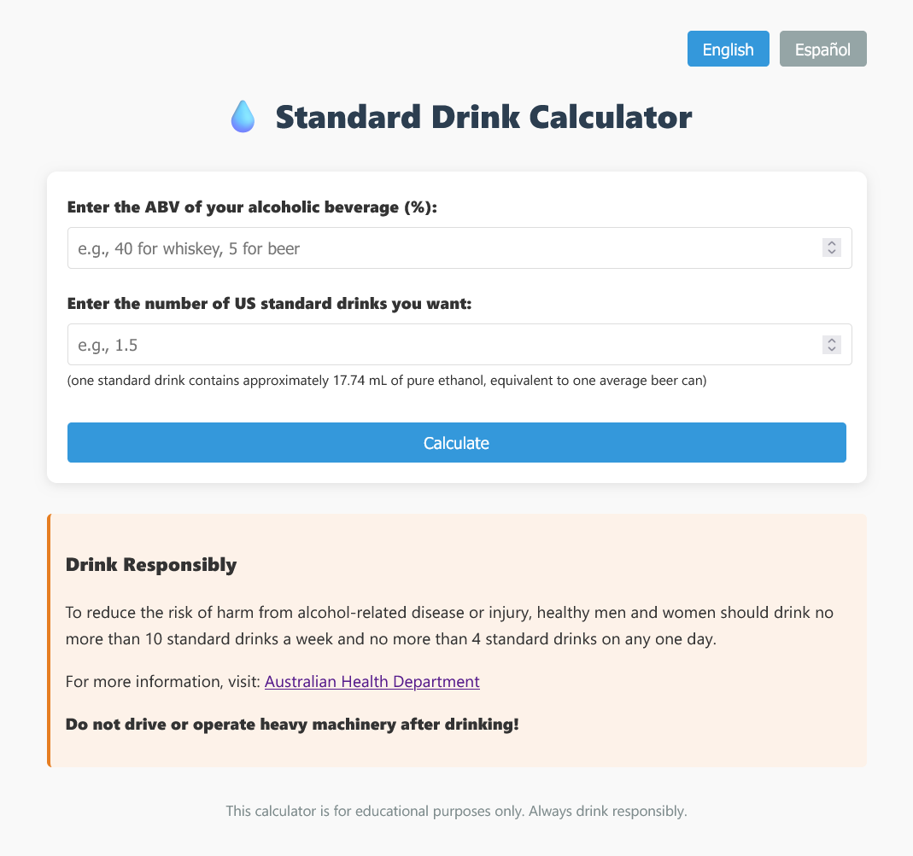

# 💧 Standard Drink Calculator

A simple, bilingual (English/Español) web app to calculate the amount of an alcoholic beverage needed to reach a desired number of US standard drinks, with optional dilution calculation. Features excellent decimal precision.

👉 [Website Link](https://neutrovertido.github.io/standard-drink-calculator/). 🇬🇧/🇪🇸

**FOR EDUCATIONAL PURPOSES ONLY**



## Features

- **Calculate required beverage volume** for a given ABV and number of US standard drinks.
- **Dilution calculator:** Find the final ABV after adding a mixer (e.g., juice).
- **Bilingual UI:** Switch between English and Spanish instantly.
- **Python CLI scripts:** The two original scripts, one in English and one in Spanish.

## What is an US Standard Drink?

A US standard drink contains approximately **17.74 mL of pure ethanol** (about the amount in a typical can of beer).

## Usage

### Web App

1. Open [`index.html`](index.html) in your browser.
2. Enter the ABV (%) of your beverage and the number of standard drinks you want (aka how many "beers" of it).
3. Click **Calculate**.
4. (Optional) Add a diluting agent and calculate the total ABV of your mix.

📚 **Switch language using the buttons at the top right.**

### Project Structure
```
index.html/
    index.css
js/
    index.js
img/
    screenshot.png
    vodka.png
docs/
    abv.py
    abv-es.py
```

### Python Scripts

- English: [`docs/abv.py`](docs/abv.py)
- Spanish: [`docs/abv-es.py`](docs/abv-es.py)

Run in your terminal:

```sh
python abv.py
# or
python abv-es.py
```


## Responsible Drinking
> To reduce the risk of harm from alcohol-related disease or injury, healthy men and women should drink **no more** than 10 standard drinks a week and **no more** than 4 standard drinks on any one day.

For more information, visit the [Australian Health Department's website](https://www.health.gov.au/topics/alcohol/about-alcohol/how-much-alcohol-is-safe-to-drink).
